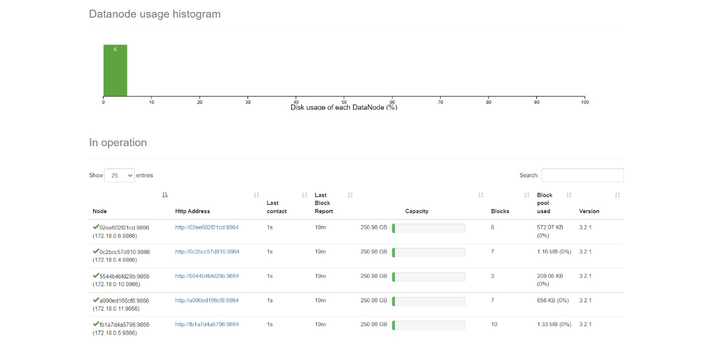

# Setup Hadoop and Hive on local with Docker

## To start Hadoop and Hive

```
docker-compose up -d
```

## Check if Hive works

```
docker exec -it hive-server /bin/bash
```

```
root@machine:# hive
hive> show databases;
hive> quit;
```

## To stop

```
docker-compose down
```


